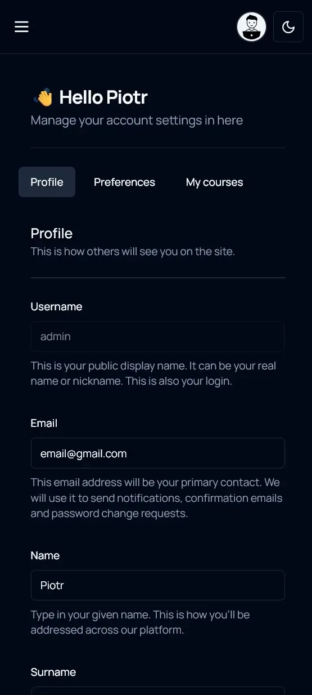

# SmartSenior

Demo website: https://talk-tactics-frontend.vercel.app/
More info: https://www.piotrpabich.com/projects/TalkTactics

Fullstack website designed to help users learn the most popular words in English. This project contains fronted repository written in Next.js 14 with App Router with combination of React Query (caching / better performance), Zod / React Hook Form (validation, better user experience), Zustand and more.

## Technologies Used

✅ Next.js 14
✅ App Router  
✅ React Hook Form  
✅ React Query
✅ Zustand  
✅ Zod  
✅ Axios

**And many more :)**

## Some app screenshots

<div style="text-align: center;">
    <br>
    <br>
    <br>
    <br>
    <br>
    <br>
</div>

## Prerequisites

1. Configure secrets

```bash

NEXT_PUBLIC_API_BASE_URL=_YOUR_DATABASE_BASE_URL OR http://localhost:8080/api/v1

```

## How to start

1. Make sure you have Node.js installed on your system. You can download and install Node.js from the official website: https://nodejs.org.
2. Open a command-line interface (CLI) or terminal and navigate to the frontend directory of the project.
3. Install the project dependencies by running the following command: npm install
4. Start development server by running command: npm run dev
5. The development server will start, and you should see console output indicating that the server is running. It will also open your default web browser and navigate to http://localhost:3000, where you can access the frontend of the project
